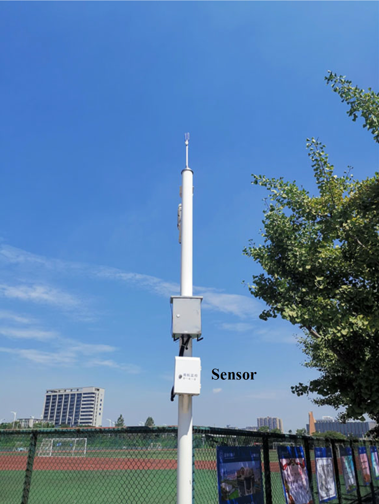

# Real-world Spectrum Dataset 
## Title
Robust Spectrum Prediction With Deep 3D Pyramid Vision Transformer Learning

## Dataset 
This paper uses three spectrum datasets collected in the real world, including frequency-modulated (FM) spectrum dataset, long-term evolution (LTE) spectrum dataset, and cross-validation spectrum dataset, to prove the effectiveness of the proposed methods. The datasets are collected at the Jungjun Road Campus of Nanjing University of Aeronautics and Astronautics (NUAA) in Nanjing, China. You can obtain all datasets from [Google Drive](https://drive.google.com/drive/folders/1w2kTaRKVRmsO5jUAovZc78W_eTQ63TDm?usp=sharing). Specific details about these three datasets are as follows:

    
    
    
 Figure 1. Spectrum sensor map (left) and actual sensor (right).

### A. FM Spectrum Dataset
The FM dataset is collected by a spectrum measurement sensor located at [118.7905 (east longitude), 31.9378 (northern latitude), 12.10 (altitude)] on the Jiangjun Road campus of the NUAA in Nanjing, China (see Fig. 1 (left) node 1, and the actual sensor is shown in Fig. 1 (right)). The collected bandwidth is 90-110 MHz. The collected data types are the in-phase (I) and quadrature (Q) signals. The range of collection time is from 17:20 on Sep. 23rd, 2022, to 20:20 on Sep. 23rd, 2022, with a sampling interval of 1 second. 

We convert the FM I/Q data collected every second to a spectrogram via the short-time Fourier transform (STFT). The configurations are: the sampling frequency is 125 MHz, the descending sampling coefficient is 4, the STFT number is 32508, the center frequency of the FM is 99 MHz, and the length-window is 256. These spectrograms constitute the FM dataset. We split the FM dataset into the training set (7200 samples with 17:20-19:20), validation set (1800 samples with 19:20-19:50), and test set (1800 samples with 19:50-20:20) with a 4:1:1 ratio in chronological order.

This dataset is used to demonstrate the superiority of the proposed methods over the baseline methods.

### B. LTE Spectrum Dataset
The LTE dataset is collected by a spectrum measurement node located at [118.7905 (east longitude), 31.9378 (northern latitude), 12.10 (altitude)] on the Jiangjun Road campus of the NUAA in Nanjing, China (see Fig. 1 node 1). The collected bandwidth is 690-710 MHz. The data type is the same as the FM spectrum dataset. The range of collection time is from 17:52 on May 2nd, 2023, to 18:32 on May 2nd, 2023, with a sampling interval of 1 second.

The STFT is also used to convert LTE I/Q data into spectrogram series. The parameters are set the same as for the FM dataset except that the STFT number is 16254 and the center frequency of the FM is 700 MHz.

This dataset is used to demonstrate the transfer learning performance of the proposed method.

### C. Cross-Validation Spectrum Dataset
The cross-validation dataset (select FM band) is collected by a spectrum collection node located at [118.7907 (east longitude), 31.9386 (northern latitude), 36.80 (altitude)] on the Jiangjun Road campus of the NUAA in Nanjing, China (see Fig. 1 node 1). The data was collected over a bandwidth of 690-710 MHz, with data types being I and Q path signals. The collection time was from 22:14 on Jul. 10, 2024, to 00:04 on Jul. 11, 2024, with a sampling interval of 1s. 

We convert the FM I/Q data collected every second to a spectrogram via the STFT. The configurations are: the sampling frequency is 125 MHz, the descending sampling coefficient is 4, the STFT number is 32508, the center frequency of the FM is 99 MHz, and the length-window is 256. These spectrograms constitute the LTE dataset. We split the spectrogram series into the training set (7200 samples with 17:20-19:20), validation set (1800 samples with 19:20-19:50), and test set (1800 samples with 19:50-20:20) with a 4:1:1 ratio in chronological order.

This dataset is used to cross-validate the superiority of the proposed methods over the baseline methods.

## Dataset
If you find this repo useful, please cite our paper.
